# BI Tool Use Cases
Business intelligence tools help you to improve decision-making and social collaboration. They provide the means for efficient reporting, thorough analysis of data, statistics, and analytics.

[Power BI](#power-bi), [Excel](#ms-excel), [Tableau](#tableau), and [Klipfolio](#klipfolio) are data visualization and business intelligence tools that convert data from different data sources to interactive dashboards and BI reports.

Security is a priority for Envi; therefore, we support tools that adhere to the latest standards in secure authentication.

Create a custom query to visualize the data you want in **Power BI** and **MS Excel**. The custom query retrieves the JWT token and then uses it in subsequent requests to the server.

## <span style="color: #F05D30">Power BI</span> 

To work easily with the Envi data in **Power BI**, you can use the following methods:

 - [Building custom query](#building-custom-query-with-power-bi)
 - [Integration with ODBC driver](#integration-with-odbc-driver-with-power-bi)


### <span style="color: #F05D30">Building custom query with Power BI</span> 

To create the query and use it for data retrieving in **Power BI**, do the following:

 1. Select **Get Data** > **Blank Query**. 
 2. In **Power Query Editor**, select **Advanced Editor** from the **Home** or **View** tab. 
 3. Use the following template to populate data from the needed endpoint. <br>
    Here, you should populate the following data:
    - ```BASE_URL```–API URL (for example, api-demo.envi.net.
    - ```RESOURCE_RELATIVE_URL```–URL to a specific resource (for example, Inventory, Vendors, Manufacturers).
    - ```USER_NAME```, ```PASSWORD```–your credentials.
    - ```DATASOURCE_NAME```–arbitrary data-source name.
    - ```//Query=[ #"$filter"="", #"$orderBy"=""]```–additional query options such as ```$filter```, ```$orderBy```, ```$top```, ```$skip```, ```$search```.

        !!! note

            If you need to use any query option, specify this line in custom query ```(Query=[ #"$filter"="", #"$orderBy"=""])```.

    !!! note

        The **099153c2625149bc8ecb3e85e03f0022** client_id is the same for all clients.

    ``` cs title="Example"
    let
        api_base_url = "BASE_URL", // e.g. https://api-demo.envi.net/,
        resource_relative_url = "RESOURCE_RELATIVE_URL", //e.g. odata/Inventory
        user_name = "USER_NAME",
        password = "PASSWORD",
        GetJson = Json.Document(Web.Contents(api_base_url & "oauth2/token",
            [
                Headers = [#"Accept"="application/json",
                            #"Content-Type"="application/x-www-form-urlencoded;charset=UTF-8"],
                Content = Text.ToBinary("username="&user_name&"&password="&password&""&"&grant_type=password&client_id=099153c2625149bc8ecb3e85e03f0022")
            ])),
            access_token = GetJson[access_token],
            AccessTokenHeader = "Bearer " & access_token,
        JsonTable =  Json.Document(Web.Contents(
        api_base_url & resource_relative_url,
        [
        //Query=[ #"$filter"="", #"$orderBy"=""],
        Headers=[#"Authorization" = AccessTokenHeader ]
        ])),
        #"DATASOURCE_NAME" = Table.FromRecords(JsonTable[value])
        in
            #"DATASOURCE_NAME"

    ```

 4. As the sample, for data retrieving, use the Inventory resource and demo environment (api-demo.envi.net). 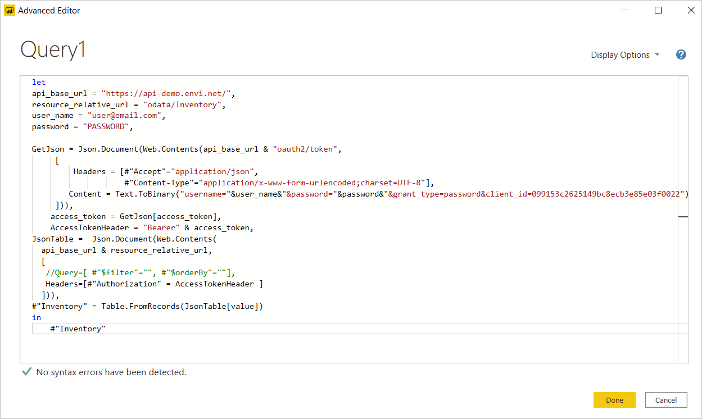
 5. Select the **Done** button. As a result, **Excel** has executed the query and the needed data is shown. 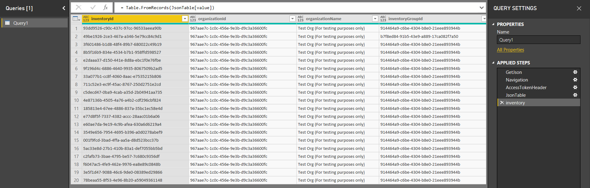
 6. Select the **Close & Apply** icon to populate data to the **Excel** spreadsheet. 

Custom Query is ready for the data retrieving. To refresh data, call the context menu of the needed query with right-click and then select **Refresh**. To modify the data, select **Edit**.

!!! note

    During the first query execution, you’ll see the warning message about data privacy and storage of sensitive information. It is recommended to set privacy credentials to **Organizational**.

### <span style="color: #F05D30">Integration with ODBC driver with Power BI</span> 

You can connect **Power BI** with the [ODBC driver](Integrators.md#odbc-powerpack-configuration) and retrieve the needed data. For this, do the following:

 1. Open the **Power BI** sheet, then go to the **Home** tab. On **Get Data**, select **More**. 
 2. In the **Get Data** dialog box, on the **Other** tab, select **ODBC**, and then select **Connect**. 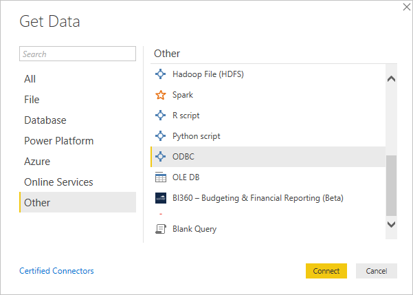
 3. From the **Data source names (DSN)** list, select **ZappySys JSON Driver** and click **OK**. 
    
    !!! note

        To specify the custom endpoint, use a query with additional parameters. For this, select **Advanced Options** on the **Get Data from ODBC** dialog box, and then specify your query with the **Src** option. <br>

 4. When the data is downloaded, in the **Navigator** dialog box, expand the **DATA** folder, select value, and then click **Load**. 
The **Load** dialog box with uploading progress appears. 
 5. Once the data is uploaded, a dataset and a list of all available columns are shown. 
 6. To refresh the date, select the **Refresh** icon. 

The integration with **Power BI** is finished. You can use retrieved data easily for your further needs.

## <span style="color: #F05D30">MS Excel</span> 
To work with Envi data easily in **MS Excel**, you can use the following methods:

 - [Building custom query](#building-custom-query-with-ms-excel)
 - [Integration with ODBC driver](#integration-with-odbc-driver-with-ms-excel)

### <span style="color: #F05D30">Building custom query with MS Excel</span> 
To create the query and use it for data retrieving in **Excel**, do the following:

1. Go to the **Data** tab, then select **Get Data** > **From Other Sources** > **Blank Query**.  
2. In **Power Query Editor**, select **Advanced Editor** from the **Home** or **View** tab. 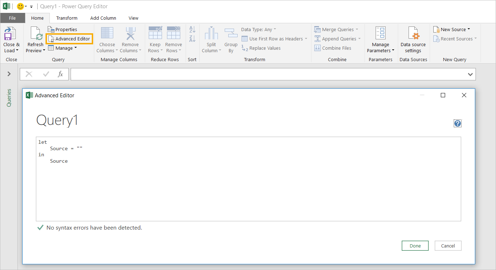 
3. Use the following template to populate data from the needed endpoint. <br> 
    Here, you should populate the following data:

    - ```BASE_URL```–API URL (for example, api-demo.envi.net).
    - ```RESOURCE_RELATIVE_URL```–URL to a specific resource (for example, Inventory, Vendors, Manufacturers).
    - ```USER_NAME```, ```PASSWORD```–your credentials.
    - ```DATASOURCE_NAME```–arbitrary data-source name.
    - ```//Query=[ #"$filter"="", #"$orderBy"=""]```–additional query options such as ```$filter```, ```$orderBy```, ```$top```, ```$skip```, ```$search```.

        !!! note

            If you need to use any query option, specify this line in custom query ```(Query=[ #"$filter"="", #"$orderBy"=""])```.

    !!! note

        The **099153c2625149bc8ecb3e85e03f0022** client_id is the same for all clients.

    ``` cs title="Example"
    let
        api_base_url = "BASE_URL", // e.g. https://api-demo.envi.net/,
        resource_relative_url = "RESOURCE_RELATIVE_URL", //e.g. odata/Inventory
        user_name = "USER_NAME",
        password = "PASSWORD",
        GetJson = Json.Document(Web.Contents(api_base_url & "oauth2/token",
            [
                Headers = [#"Accept"="application/json",
                            #"Content-Type"="application/x-www-form-urlencoded;charset=UTF-8"],
                Content = Text.ToBinary("username="&user_name&"&password="&password&""&"&grant_type=password&client_id=099153c2625149bc8ecb3e85e03f0022")
            ])),
                access_token = GetJson[access_token],
                AccessTokenHeader = "Bearer " & access_token,
                JsonTable =  Json.Document(Web.Contents(
                api_base_url & resource_relative_url,
        [
        //Query=[ #"$filter"="", #"$orderBy"=""],
        Headers=[#"Authorization" = AccessTokenHeader ]
        ])),
        #"DATASOURCE_NAME" = Table.FromRecords(JsonTable[value])
        in
            #"DATASOURCE_NAME"

    ```

 4. As the sample, the Inventory resource and demo environment (api-demo.envi.net) can be used for data retrieving:  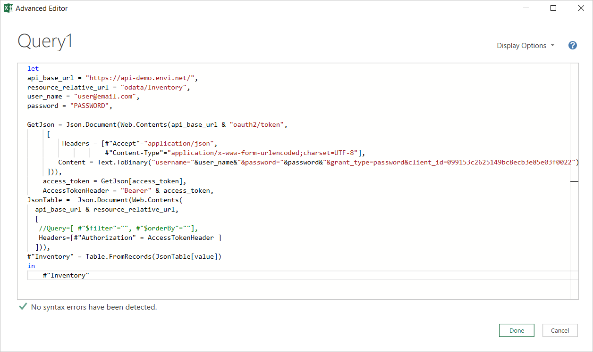 
 5. Select the **Done** button. As a result, **Excel** has executed the query and the needed data is shown.  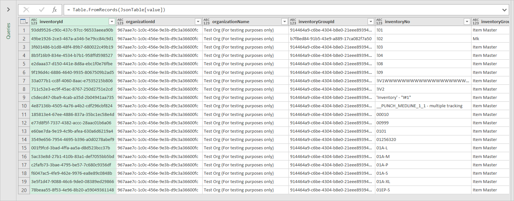 
 6. Select the **Close & Load** icon to populate data to the **Excel** spreadsheet. 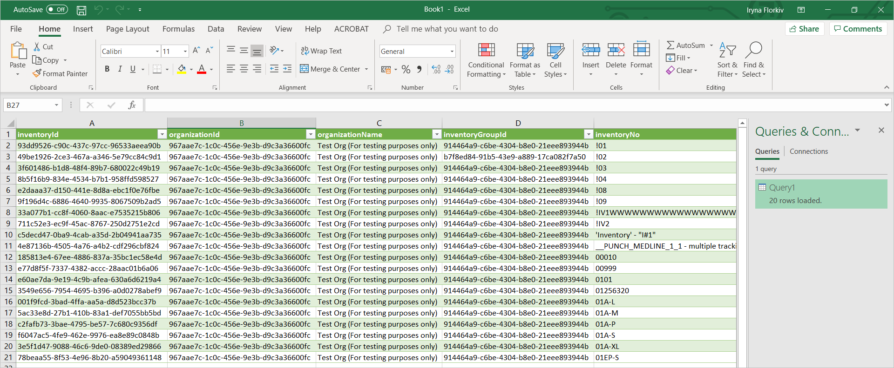 

Custom Query is ready for the data retrieving. To refresh data, call the context menu of the needed query with right-click and select **Refresh**. To modify the data, select **Edit**.

!!! note
    
    During the first query execution, you’ll see the warning message about data privacy and storage of sensitive information. 

To resolve this issue, do the following:

1. Click **Continue** and set privacy credential to **Organizational**.  
2. Click **Save**. <br> Your choice will be saved for the given external data source (for example, api-demo.envi.net). <br> Also, you can see the message about credentials for the external data source.  


To resolve this issue, do the following:

1. Click **Edit Credentials**.  
2. Select the **Anonymous** access, and then click the **Connect** button.

Your choice will be saved for the given external data source (for example, api-demo.envi.net).

### <span style="color: #F05D30">Integration with ODBC driver with MS Excel</span> 

You can connect **MS Excel** with the [ODBC driver](Integrators.md#odbc-powerpack-configuration) and retrieve the needed data. For this, do the following:

1. Open a new **Microsoft Excel** sheet, go to the **Data** tab, select **From Other Sources**, and select **From Microsoft Query**. 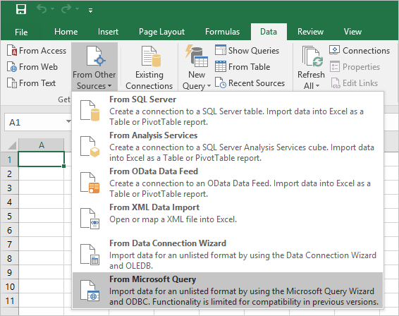 
2. Select **ZappySys JSON Driver**, then select **OK**.  
3. When the **Data Source** is successfully connected, select **value** from **Available tables and columns**, move it to **Columns in your query**, and select **Next**. 
4. Skip the **Filter Data** and **Sort Order** steps. Select the **View data or edit query** option on the **Finish** dialog box, and then click **Finish**.  
5. In the **Microsoft Query** editor, select the **SQL** icon. 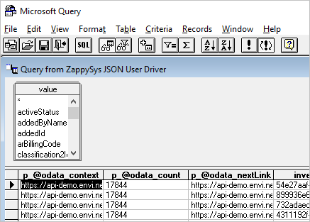 
6. In the **SQL statement** dialog box, if needed, modify the query, and select **OK**.  


    Also, you can use the query example copied on the last step ([Integrators](Integrators.md#cdata-odbc-driver-for-odata), step 14) of driver configuration. With this sample query, you can specify additional parameters different from the default driver configuration, such as modifying the endpoint address and using the same driver instance for different entities. The following options are available:

    ``` 
    WITH(
            Src='https://api-demo.envi.net/odata/Inventory'
            ,DataConnectionType='OAuth'
            ,TokenUrl='https://api-demo.envi.net/oauth2/token'
            ,ScopeSeparator='{space}'
            ,OAuthVersion='OAuth2'
            ,GrantType='Password'
            ,UserName=email@domain.com'
            ,ClientId='099153c2625149bc8ecb3e85e03f0022'
            ,UseCustomApp='True'
            ,Filter='$.value[*]'
            ,NextUrlAttributeOrExpr='$.[''@odata.nextLink'']'
        )
        
    ```

    Populate only the option(s) you would like to change. For example, to retrieve Vendors data with the driver, which is configured to use the Inventory endpoint, specify the Src option with a new URL https://api-demo.envi.net/odata/Vendors. Here is the full query with all available columns:

    ``` 
    SELECT * FROM $
      WITH(
         Src='https://api-demo.envi.net/odata/Inventory'
      )
        
    ```

7. Once you close the **Microsoft Query** editor, the **Import Data** dialog box will be shown. At this point, you have a few options on how to use the retrieved data. For example, select **Table** and then click **OK**.  
 
8. **MS Excel** will execute your query and populate the sheet with the retrieved data.  
9. To refresh data, go to the **Data** tab and  select the **Refresh All** icon.  

The integration with **Microsoft Excel** is complete. You can use the retrieved data easily for your further needs.


## <span style="color: #F05D30">Tableau</span> 

 - [Integration with ODBC](#integration-with-odbc-with-tableau)
 - [Integration with Microsoft SQL Server](#integration-with-microsoft-sql-server-with-tableau)

### <span style="color: #F05D30">Integration with ODBC with Tableau</span> 

You can connect **Tableau** with the **ODBC driver** and retrieve the needed data. For this, do the following:

 1. In the **Tableau** app, create a **New** book. <br> 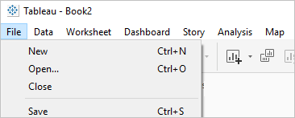 
 2. On the **Data** tab, select the **Connect to Data** link.  
 3. Select **Other Databases (ODBC)**.  
 4. Select **ZappySys JSON Driver** as the **DNS**, and then select **Connect**. 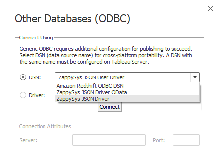 
 5. After the connection is established, select **Sign In**.  
 6. The driver is added to **Connections**. In the **Table** section, select the **Search** icon, and then double-click the **value**.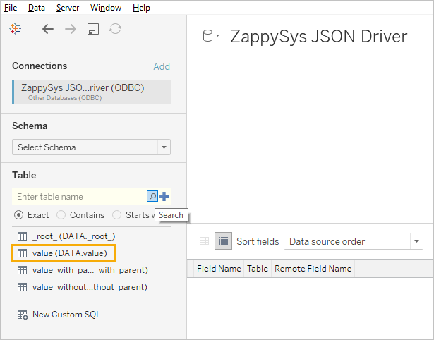 <br> The data is populated successfully. <br> 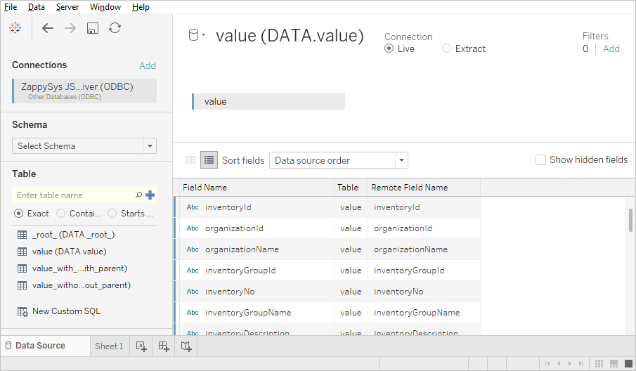 
 7. Navigate to a sheet and continue working with the data according to your needs. 
 8. To refresh the data, select **Data** > **value (DATA.value)** > **Refresh**.  

### <span style="color: #F05D30">Integration with Microsoft SQL Server with Tableau</span> 
Except for the direct **ODBC driver** connection, you can also connect **Tableau** using **Linked Server** ([Integrators](Integrators.md#cdata-odbc-driver-for-odata), step 20), which is already connected to the **ODBC driver**. For this, do the following:

 1. In the **Tableau** app, create a **New** book. <br>  
 2. On the **Data** tab, select the **Connect to Data** link.  
 3. Select **Microsoft SQL Server**.  
 4. Provide the SQL Server connection information and click **Sign In**.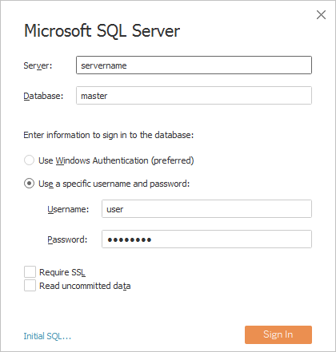 
 5. The SQL Server is added to **Connections**. Click **New Custom SQL**, then specify a query using the **OPENQUERY** syntax and click **OK**. 
 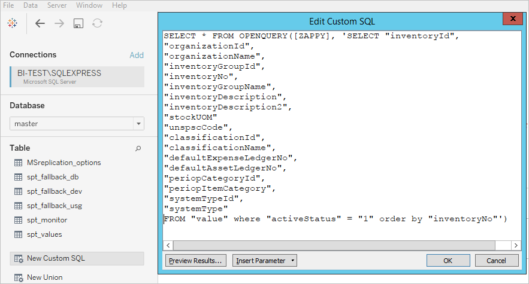 <br> The SQL query is created and data is populated successfully. <br>  
6. Go to a sheet and continue working with the data according to your needs.  

Integration with **Tableau** is finished. You can use retrieved data easily for your further needs.

## <span style="color: #F05D30">Klipfolio</span> 

The **Klipfolio Dashboard** allows you to combine all of your marketing data in one place to create powerful and compelling data dashboards.

This guide describes how to configure pie chart components with Purchase Order’s vendors and statuses as a sample.

Creating the dashboard with the needed data using the Klipfolio service consists of two stages:

 - [Connecting to the needed data source](#new-data-source-with-klipfolio)
 - [Visualizing your data with Klips elements](#new-dashboard-with-klipfolio)

### <span style="color: #F05D30">New data source with Klipfolio </span> 

To create a new data source and connect it to the dashboard, do the following:

1. Go to the **Data Sources** menu item. Then, select **Create a New Data Source**. 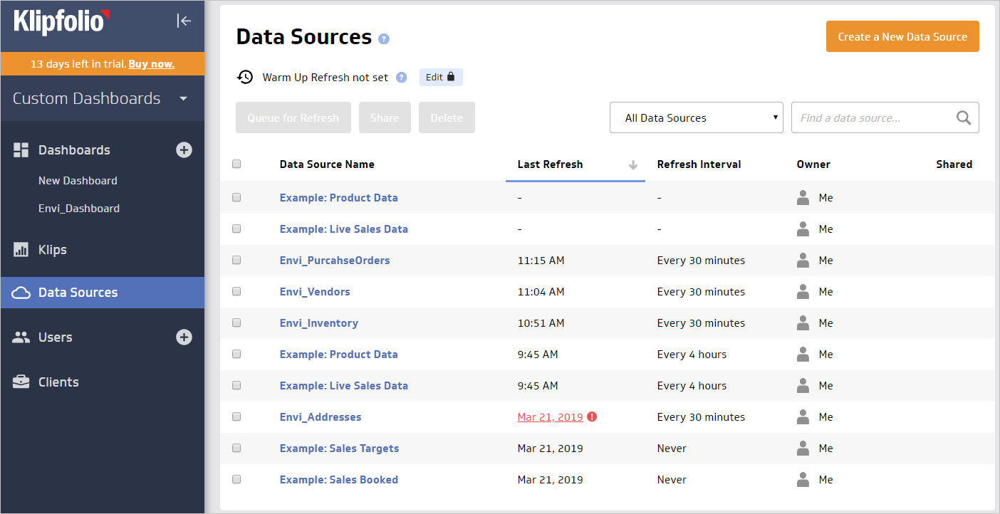  
2. Select the **REST/URL** data source type.   
3. To configure data source:<br>
    1. Type the needed URL.

    
        !!! note

                For example, ``` https://<HostName>/odata/PurchaseOrders ```
                (in case, **&lt;HOSTNAME&gt;** = api-demo.envi.net).

    2. Select the **JSON** data format and the **GET** HTTP method.

    
        !!! note

                Leave the **UTF-8** value in the **Encoding** field.

    3. Type the following query parameters: <br>
        - **Name**: Authorization <br>
        - **Value**: Bearer [auth_token] <br>
        - **Type**: Header <br>   
            
4. Open the **Authentication** (OAuth, 2-Step, X-WSSE, or Basic) section, then do the following:
    1. Select the **2-Step Authentication** type.
    2. Type your login and password.
    3. Select the **TEXT** response and the **POST** method.
    4. In the **Body** field, type the value using the following template: 
    ```
    grant_type=password&username=[username]&password=[password]&client_id=099153c2625149bc8ecb3e85e03f0022
    ```

        !!! note

                The **099153c2625149bc8ecb3e85e03f0022** client_id is the same for all clients.

    4. Specify the following parameters:
        - **Name**: Content-Type <br>
        - **Value**: application/x-www-form-urlencoded <br>
        - **Type**: Header  

    5. In the **Auth URL** field, type the following URL:
    
        !!! note

                For example, ``` https://<HOSTNAME>/oauth2/token ```
                (in case, **&lt;HOSTNAME&gt;** = api-demo.envi.net).

    6. In the **Token Path** field, type the following value: **"access_token":"(.*?)"**
    7. Select the **GET** logout method and leave the **Logout URL** field empty.   

4. **Submit** the configuration.
6. Verify the entered data and select **Continue**. 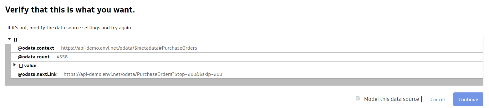  
7. Save the data source with the following steps:
    1. Type the **Name** and **Description**.
    2. Specify **Queue for Refresh**.
    3. Set your **Sharing** preferences.  

After all entered data is saved, you will see your newly created data source.   

### <span style="color: #F05D30">New dashboard with Klipfolio</span> 
To create a new dashboard with the needed data:

1. In the **Dashboards** section of the **Klipfolio** menu, select **+** to create a new dashboard.
2. Select **Add a Klip**, then **Build a Custom Klip**.   
3. To use an existing data source from the library, at the bottom of the page, in the **Data** tab, click the **+ Add Data Source**.
4. In the **Add a Data Source** dialog box, select the data source you have already created.  
5. As a sample, select the **Pie Chart** component.   
6. From the **Values** menu, select the values you want to add to the pie chart. For example, Purchase Orders.   
7. To group all purchase orders by label, select the **Group Repeating** labels checkbox on the **Properties** tab.   
8. From the **Labels** menu, select the label you want to add to the pie chart. For example:
    1. **Purchase Order’s Vendors** pie chart  <br> 
    or <br>
    2. **Purchase Order’s Statuses** pie chart   

9. Go to the **Pie Chart Properties** tab and select the appropriate number of pie chart slices.

    !!! note

            Make the pie chart large so that it doesn’t have the pagination showing.   


10. By default, there are only nine colors for pie slices, so that you can see a few slices with the same colors. To add more colors to your chart, do the following:
    1. Select the **Override the default colors** checkbox.
    2. Click the **+** icon to add a new color and select the appropriate one.
11. Go to the **Klip Properties** tab, and then add the **Klip** title.   
12. Add **Description**.
13. Select the **Sharing** options if needed.
14. Save your newly created **Klip**.

**Pie Chart** for **Purchase Orders** is configured and ready for use. 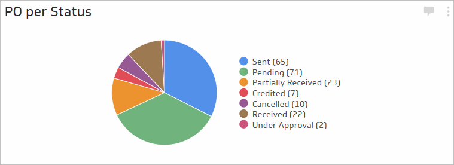  


