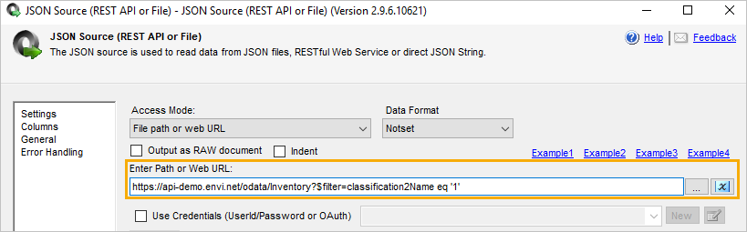
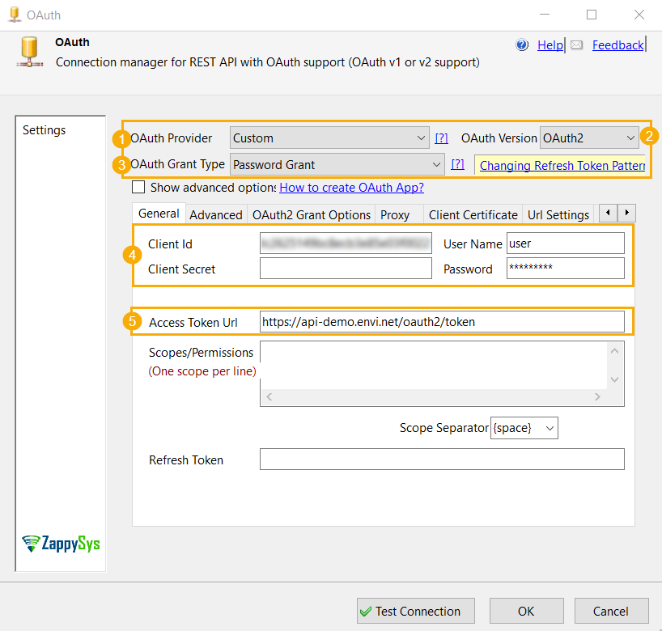
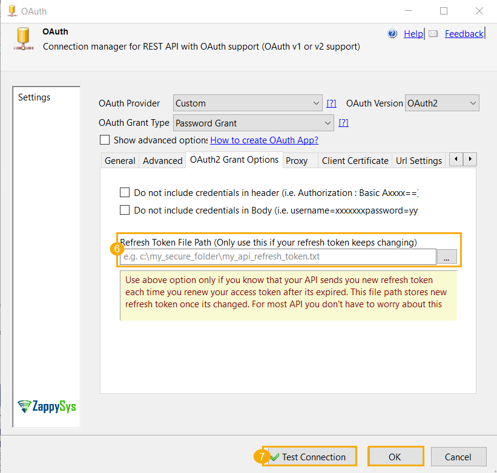
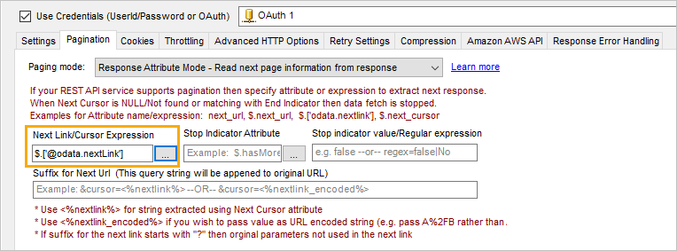
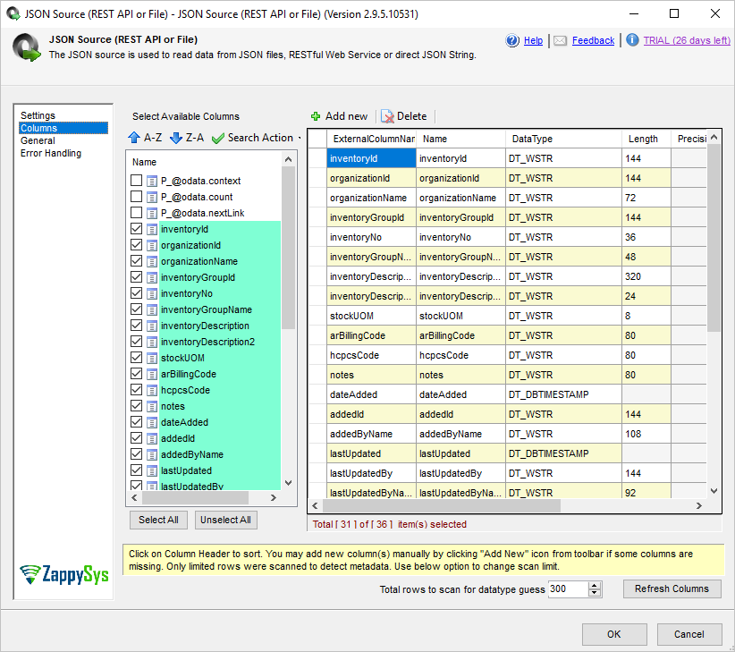
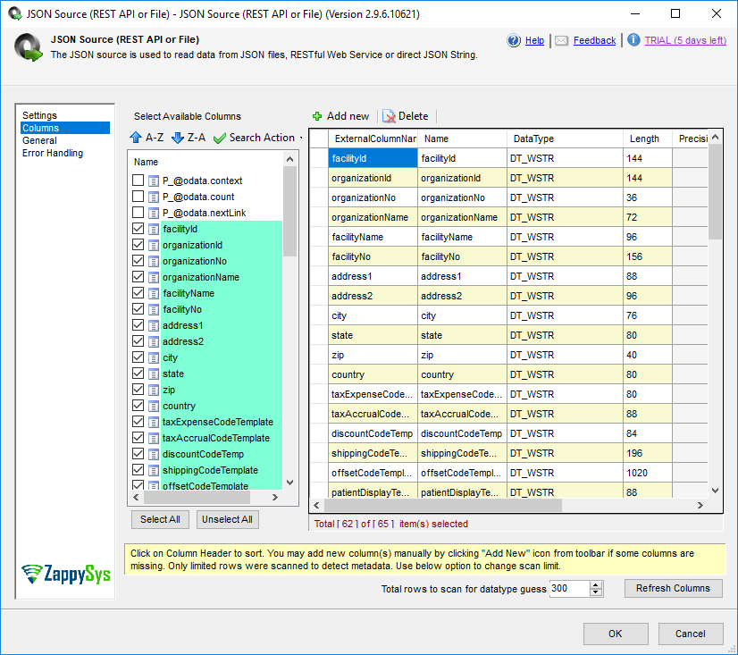
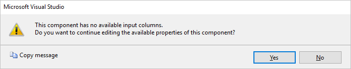
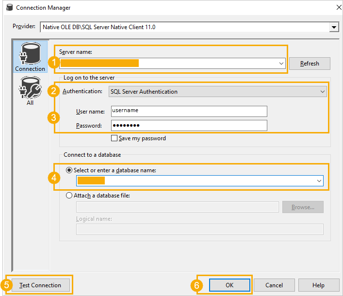
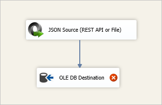

If you want to integrate Envi API into your SQL Server Data Tools and retrieve the needed data easily, you can use the following applications:

 - [SSIS Powerpack](#ssis-powerpack)
 - ODBC Powerpack
Before working with integrators, please see the following requirements and installation:

**For SSIS Powerpack**

 - .NET Framework 3.5
 - SSISPowerPackSetup_64bit
 - [SSDT](https://docs.microsoft.com/en-us/sql/ssdt/download-sql-server-data-tools-ssdt?view=sql-server-2017) (SSDT-Setup-ENU) for Analysis Services, Integration Services, or Reporting Services projects

**For Linked Server**

 - [SQLServer2017-SSEI-Expr](https://www.microsoft.com/en-us/sql-server/sql-server-2019)
 - [Microsoft SQL Server Management Studio (SSMS-Setup-ENU)](https://docs.microsoft.com/en-us/sql/ssms/download-sql-server-management-studio-ssms?view=sql-server-2017)

## <span style="color: #F05D30">SSIS Powerpack</span> 

With the **SSIS Powerpack** tool, you can easily retrieve data from Envi OData API and insert it to the MSSQL database. To do it:

 - [Create JSON Source](#create-json-source)
 - [Build Database schema in MS SQL Server](#build-database-schema-in-ms-sql-server)
 - Test SSIS Package

### <span style="color: #F05D30">Create JSON Source</span> 
1. Download and install [SSIS ZappySys PowerPack](https://zappysys.com/products/ssis-powerpack/).
2. After installation, open [Microsoft SQL Server Data Tool for Visual Studio (SSDT)](https://docs.microsoft.com/en-us/sql/ssdt/download-sql-server-data-tools-ssdt?view=sql-server-2017), and then create a new **Integration Services Project**. For this, on the **File** tab, select **New Project**.

    !!! note

        Select location where to save the project and name it. 

3. Add **Data Flow Task**. For this, drag the **ZS JSON Source** (REST API or File) to the board. 

    !!! note

        You can rename the task easily (for example, **API to MSSQL**). For this, just click the record.

4. Double-click the **Data Flow Task** to see the **DataFlow Design** dashboard.

    !!! note

        Also, you can select the Data Flow tab for this.

5. Drag the **ZS JSON Source (REST API or File)** to the board from the **SSIS** toolbox. 
6. Double-click **JSON Source (REST API or File)** for the following configuration:
    1. Enter the needed **Path** or **Web URL** you need, and then add the appropriate query parameters:

        For example, 
        ```
        https://<HOSTNAME>/odata/<ENDPOINT>$<QUERY>
        
        ``` 
        (in case, **&lt;HOSTNAME&gt;** = api-demo.envi.net). 

        

        !!! note

                You can use the following examples to retrieve the needed data:

            ```title="Example"
            Inventory items URL: https://api-demo.envi.net/odata/Inventory?$filter=classification2Name eq '1'
            Facilities URL: https://api-demo.envi.net/odata/Facilities
            Vendors URL: https:// api-demo.envi.net/odata/Vendors
            Disputed Invoices URL: https:// api-demo.envi.net/odata/MatchedInvoices?$filter=matchedInvoiceStatus eq 'Disputed'
            Pending Batched Invoices URL:  https:// api-demo.envi.net/odata/BatchedInvoices?$filter=batchStatus eq 'Pending'
            ```
                Before adding new data flows to the existing one, disable previous items. For this, right-click the Data Flow Task and select Disable. After that, you’ll see the following result: 

    2. Select the **Use Credentials** checkbox. From the dropdown menu, select the **New ZS-OAuth Connection** option. 

7. After selecting the **New ZS-OAuth** option, the **OAuth** dialog box is shown. Perform the following settings:
    1. From the **OAuth Provider** dropdown menu, select the **Custom** option.
    2. From the **OAuth Version** dropdown menu, select the **OAuth2** option.
    3. From the **OAuth Grant Type** dropdown menu, select the **Password Grant** option.
    4. Enter **Client ID**, **User Name**, and **Password**.
    5. Enter **Access Token URL**. (for example, ```api-demo.envi.net/oauth2/token```) <br> 

8. Go to the **OAuth2 Grand Options** tab, select the ellipsis **(…)** button, and provide a refresh token file path.

    !!! note

        The file name extension should be **.txt**. The file should be empty.

    !!! note
    
        Place the file in a separate and non-shared folder.

9. Select **Test Connection** and click **OK**. 

    !!! note
    
        If you want to sign in organization that is not your default one, go to the **Advanced** tab of **OAuth** settings, and then in the **Extra Attributes for /token Request** field, specify the **ID** of the needed organization as an additional parameter with the **organizationId** value: 

10. On the **Filter Options** tab, click the **Select Filter** button.

    !!! note
    
        Ensure, that **OAuth 2** is preselected.
    
    

11. Select the **value** filter path, then click **OK**. 
10. In the **Metadata Scan Options** dialog box, click **OK**. 
11. In the **JSON Source (REST API or File)** dialog box, select the **Pagination** tab.
12. From the **Next Link/Cursor Expression** field, select the ellipsis **(…)** button. 
13. Select **@odata.nextLink**, and then click **OK**. 
14. In the **JSON Source (REST API or File)** dialog box, go to the **Columns** section, and then select the needed fields. Click **OK**.  <br> 


    ??? example "Facility columns" 
    
        

    ??? example "Vendor columns" 

        

    ??? example "Disputed Matched Invoice columns"

        

    ??? example "Pending Batched Invoice columns"

        


    The **JSON Source** setup is complete. Go to the **JSON Source (REST API or File)** dialog box, and then in the **Settings** section, select **Preview** to view the retrieved data. 

The data is retrieved successfully. 

### <span style="color: #F05D30">Build Database schema in MS SQL Server</span> 
1. In **MS SQL Studio**, create a needed table.

    !!! note
    
        For this, create new database or add the table to the existing one. [Column data types](https://wiki.melissadata.com/?title=FAQ%3ASSIS%3AData_Type_Conversions) should be taken from the 16th step of the previous section.

    ??? example "Inventory Table" 
    
        ```
        CREATE TABLE [dbo].[Inventory](
        [inventoryId] [nvarchar](144) NOT NULL,
        [organizationId] [nvarchar](144) NOT NULL,
        [organizationName] [nvarchar](255) NULL,
        [inventoryGroupId] [nvarchar](144) NULL,
        [inventoryNo] [nvarchar](255) NULL,
        [inventoryGroupName] [nvarchar](255) NULL,
        [inventoryDescription] [nvarchar](320) NULL,
        [inventoryDescription2] [nvarchar](255) NULL,
        [stockUOM] [nvarchar](50) NULL,
        [arBillingCode] [nvarchar](80) NULL,
        [hcpcsCode] [nvarchar](80) NULL,
        [notes] [nvarchar](255) NULL,
        [dateAdded] [datetime2](7) NULL,
        [addedId] [nvarchar](144) NULL,
        [addedByName] [nvarchar](255) NULL,
        [lastUpdated] [datetime2](7) NULL,
        [lastUpdatedBy] [nvarchar](144) NULL,
        [lastUpdatedByName] [nvarchar](100) NULL,
        [activeStatus] [bit] NULL,
        [unspscCode] [nvarchar](80) NULL,
        [isLatex] [bit] NULL,
        [classificationId] [nvarchar](144) NULL,
        [classificationName] [nvarchar](100) NULL,
        [classification2Id] [nvarchar](144) NULL,
        [classification2Name] [nvarchar](100) NULL,
        [defaultExpenseLedgerNo] [nvarchar](100) NULL,
        [defaultAssetLedgerNo] [nvarchar](100) NULL,
        [periopCategoryId] [nvarchar](144) NULL,
        [periopItemCategory] [nvarchar](100) NULL,
        [systemTypeId] [int] NULL,
        [systemType] [nvarchar](100) NULL,
        [defaultIsBillable] [bit] NULL
        ) ON [PRIMARY]
        GO
        ```
        

    ??? example "Facility Table" 
        
        ```
        CREATE TABLE [dbo].[Facilities](
        [facilityId] [nvarchar](144) NOT NULL,
        [organizationId] [nvarchar](144) NULL,
        [organizationNo] [nvarchar](36) NULL,
        [organizationName] [nvarchar](72) NULL,
        [facilityName] [nvarchar](96) NULL,
        [facilityNo] [nvarchar](156) NULL,
        [address1] [nvarchar](255) NULL,
        [address2] [nvarchar](255) NULL,
        [city] [nvarchar](76) NULL,
        [state] [nvarchar](80) NULL,
        [zip] [nvarchar](40) NULL,
        [country] [nvarchar](80) NULL,
        [taxExpenseCodeTemplate] [nvarchar](255) NULL,
        [taxAccrualCodeTemplate] [nvarchar](255) NULL,
        [discountCodeTemp] [nvarchar](84) NULL,
        [shippingCodeTemplate] [nvarchar](255) NULL,
        [offsetCodeTemplate] [nvarchar](1020) NULL,
        [patientDisplayTemplate] [nvarchar](255) NULL,
        [poglCodeDisplayTemplate] [nvarchar](80) NULL,
        [poDeptDisplayTemplate] [nvarchar](80) NULL,
        [activeStatus] [bit] NULL,
        [inventoryGroupId] [nvarchar](144) NULL,
        [inventoryGroupNo] [nvarchar](44) NULL,
        [inventoryGroupName] [nvarchar](56) NULL,
        [apToleranceLevel] [decimal](18, 4) NULL,
        [apToleranceLevelType] [tinyint] NULL,
        [apToleranceLevelTypeValue] [nvarchar](255) NULL,
        [apToleranceLevel2] [decimal](18, 4) NULL,
        [apToleranceLevel2Type] [tinyint] NULL,
        [apToleranceLevel2TypeValue] [nvarchar](255) NULL,
        [apFreeFormedToleranceLevel] [decimal](18, 4) NULL,
        [apFreeFormedToleranceLevelType] [tinyint] NULL,
        [apFreeFormedToleranceLevelTypeValue] [nvarchar](255) NULL,
        [apFreeFormedToleranceLevel2] [decimal](18, 4) NULL,
        [apFreeFormedToleranceLevel2Type] [tinyint] NULL,
        [apFreeFormedToleranceLevel2TypeValue] [nvarchar](255) NULL,
        [apOffsetTolerance] [decimal](18, 4) NULL,
        [apOffsetToleranceType] [tinyint] NULL,
        [apOffsetToleranceTypeValue] [nvarchar](4) NULL,
        [taxType] [tinyint] NULL,
        [taxTypeValue] [nvarchar](4) NULL,
        [taxAmount] [decimal](18, 4) NULL,
        [taxExpenseType] [tinyint] NULL,
        [taxExpenseTypeValue] [nvarchar](4) NULL,
        [taxExpenseAmount] [tinyint] NULL,
        [facilityNoXref] [nvarchar](255) NULL,
        [taxShipping] [bit] NULL,
        [poGlValidation] [nvarchar](255) NULL,
        [poGlValidationMsg] [nvarchar](255) NULL,
        [capitalPOGlValidation] [nvarchar](80) NULL,
        [capitalPOGlValidationMsg] [nvarchar](255) NULL,
        [timeZoneId] [nvarchar](144) NULL,
        [timeZone] [nvarchar](255) NULL,
        [preferenceCardMatching] [tinyint] NULL,
        [preferenceCardMatchingValue] [nvarchar](52) NULL,
        [dateCreated] [datetime2](7) NULL,
        [createdBy] [nvarchar](144) NULL,
        [createdByName] [nvarchar](100) NULL,
        [lastUpdated] [datetime2](7) NULL,
        [lastUpdatedBy] [nvarchar](144) NULL,
        [lastUpdatedByName] [nvarchar](88) NULL
        ) ON [PRIMARY]
        GO
            
        ```


    ??? example "Vendor Table" 
        
        ```
        CREATE TABLE [dbo].[Vendors](
        [vendorId] [nvarchar](144) NOT NULL,
        [vendorNo] [nvarchar](144) NULL,
        [vendorName] [nvarchar](152) NULL,
        [organizationId] [nvarchar](144) NULL,
        [organizationNo] [nvarchar](36) NULL,
        [organizationName] [nvarchar](72) NULL,
        [vendorNotes] [nvarchar](596) NULL,
        [dateAdded] [datetime2](7) NULL,
        [addedBy] [nvarchar](144) NULL,
        [addedByName] [nvarchar](108) NULL,
        [lastUpdated] [datetime2](7) NULL,
        [lastUpdatedBy] [nvarchar](144) NULL,
        [lastUpdatedByName] [nvarchar](88) NULL,
        [activeStatus] [bit] NULL,
        [url] [nvarchar](255) NULL,
        [systemVendorName] [nvarchar](176) NULL,
        [ediVendorNo] [nvarchar](108) NULL
        ) ON [PRIMARY]
        GO
        ```

    ??? example "Disputed Matched Ivoice Table" 
        
        ```
        CREATE TABLE [dbo].[MatchedInvoices](
        [apMatchedInvoiceId] [nvarchar](144) NOT NULL,
        [purchaseOrderId] [nvarchar](144) NULL,
        [purchaseOrderNo] [nvarchar](48) NULL,
        [sequenceNo] [nvarchar](80) NULL,
        [poType] [nvarchar](36) NULL,
        [facilityId] [nvarchar](144) NULL,
        [facilityNo] [nvarchar](44) NULL,
        [facilityName] [nvarchar](80) NULL,
        [locationId] [nvarchar](144) NULL,
        [locationNo] [nvarchar](68) NULL,
        [locationName] [nvarchar](72) NULL,
        [vendorId] [nvarchar](144) NULL,
        [vendorNo] [nvarchar](144) NULL,
        [vendorName] [nvarchar](152) NULL,
        [invoiceNo] [nvarchar](88) NULL,
        [matchedInvoiceStatusId] [bit] NULL,
        [matchedInvoiceStatus] [nvarchar](32) NULL,
        [vendorRemitToId] [nvarchar](144) NULL,
        [remitToNo] [nvarchar](92) NULL,
        [remitToDescription] [nvarchar](216) NULL,
        [remitToVendorNo] [nvarchar](80) NULL,
        [creditCardIDId] [nvarchar](144) NULL,
        [creditCardID] [nvarchar](80) NULL,
        [creditCardIDDescription] [nvarchar](92) NULL,
        [reference] [nvarchar](80) NULL,
        [notes] [nvarchar](1020) NULL,
        [invoiceDate] [datetime2](7) NULL,
        [invoiceDueDate] [datetime2](7) NULL,
        [trackingCode] [nvarchar](1020) NULL,
        [invoiceValidationTotal] [nvarchar](80) NULL,
        [cerNoId] [nvarchar](1020) NULL,
        [cerNo] [nvarchar](1020) NULL,
        [cerNoDescription] [nvarchar](1020) NULL,
        [discountAmount] [decimal](18, 4) NULL,
        [taxAmount] [decimal](18, 4) NULL,
        [shippingAmount] [decimal](18, 4) NULL,
        [taxExpenseGLCode] [nvarchar](84) NULL,
        [taxAccrualGLCode] [nvarchar](100) NULL,
        [discountGLCode] [nvarchar](88) NULL,
        [taxExpenseAmount] [decimal](18, 4) NULL,
        [apBatchId] [nvarchar](1020) NULL,
        [apBatchNo] [nvarchar](1020) NULL,
        [taxCode] [nvarchar](80) NULL,
        [receivedInvoiceId] [nvarchar](144) NULL,
        [offset] [decimal](18, 4) NULL,
        [offsetGLCode] [nvarchar](1020) NULL,
        [createdBy] [nvarchar](144) NULL,
        [createdByUserName] [nvarchar](108) NULL,
        [dateCreated] [datetime2](7) NULL,
        [lastUpdated] [datetime2](7) NULL,
        [lastUpdatedBy] [nvarchar](144) NULL,
        [lastUpdatedByUserName] [nvarchar](96) NULL,
        [submittedBy] [nvarchar](144) NULL,
        [submittedByUserName] [nvarchar](108) NULL
        ) ON [PRIMARY]
        GO  
        ```
    
    ??? example "Pending Batched Ivoice Table" 
        
        ```
        CREATE TABLE [dbo].[BatchedInvoices](
        [apBatchedInvoiceId] [nvarchar](144) NOT NULL,
        [batchNo] [nvarchar](44) NULL,
        [reference] [nvarchar](80) NULL,
        [batchStatusId] [tinyint] NULL,
        [batchStatus] [nvarchar](28) NULL,
        [batchTotal] [decimal](18, 4) NULL,
        [invoiceCount] [tinyint] NULL,
        [isScheduledExporting] [bit] NULL,
        [lastExportDate] [nvarchar](80) NULL,
        [dateCreated] [datetime2](7) NULL,
        [createdBy] [nvarchar](144) NULL,
        [createdByUserName] [nvarchar](108) NULL,
        [lastUpdated] [datetime2](7) NULL,
        [lastUpdatedBy] [nvarchar](144) NULL,
        [lastUpdatedByUserName] [nvarchar](100) NULL
        ) ON [PRIMARY]
        GO
            
        ```

2. Add **OLE DB Destination** to the **Data Flow Task**. For this, drag **Ole DB Destination** to the board.  
3. Double-click **Ole DB Destination** for further configuration, and then select the **New** button.   
4. Once you see the following message, click **Yes**.    
5. In **Configure OLE DB Connection Manager**, click **New**.    
6. In the **Connection Manager** dialog box, perform the following steps:
    1. Add **Server Name**.
    2. Specify type of **Authentication**.
    3. Enter credentials.
    4. Select or enter a database name.
    5. Select **Test Connection** and click **OK**.   

7. Select **OLE DB connection manager**, then select the table from the dropdown list and click **OK**.   
8. Connect items using arrow. For this, click **Json Source (REST API or File)** and select the **arrow**. <br>  
9. Double-click **OLE DB Destination**. On **OLE DB Destination Editor**, go to the **Mapping** section to verify connections, and then click **OK**.  


