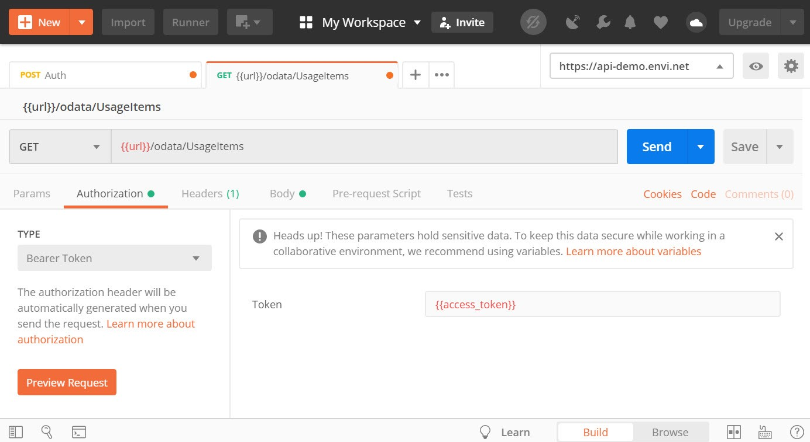

To get started with the Envi OData API, we recommend to use a tool like Postman to test example requests. Postman is a tool that lets you construct, execute, and test HTTP requests in a quick and easy way. In this tutorial, you’ll learn how to set up environment and collection in Postman to work with different sample queries and see the results.

To run the collection in Postman, using our Github repository, perform the following:

1. Install **Postman** packaged app.
2. Sign in or register in Postman, and then open the app.
3. Go the [Download from Github](https://github.com/envi/Envi.SDK/tree/master/PostmanCollections). Import the **Envi.SDK.Examples.json** file from the Github repository.
4. Each endpoint requires its URL to the environment and an access token. Use your token for each request. For more information about access token, go to the Authentication article.

Once you have successfully imported the collection, you obtain a collection of requests for the most common operations, supported by the Envi OData API.

!!! note 

    For testing OData API with provided collection, specify environment before sending any request. The environment should contain variable with name url and value that represents base url of api (for example, https://api-demo.envi.net).
    
    If you want to edit any of your environments or create the new one, click the Manage your Environments button.

